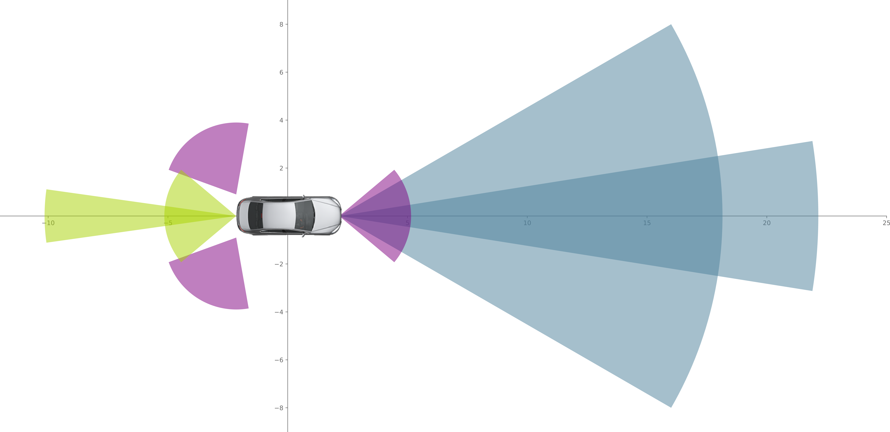
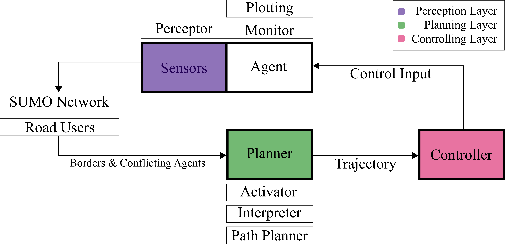
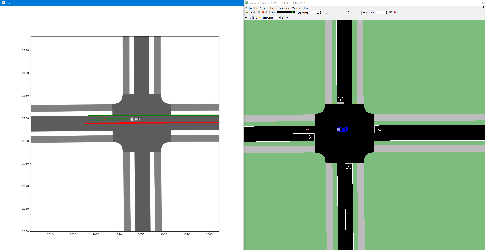
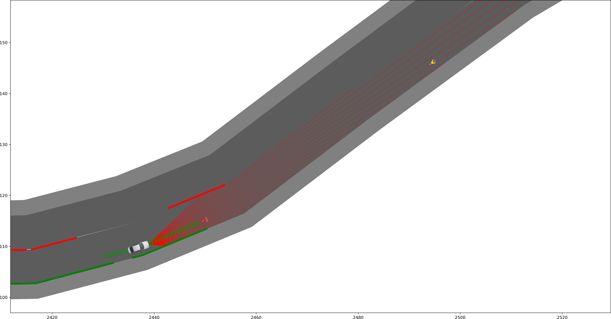
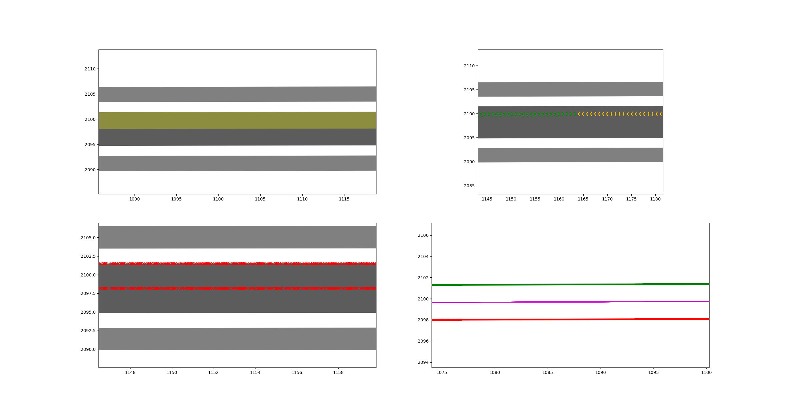

# Kimarite
This project proposes an autonomous vehicle model for the use in microscopic traffic simulations. To evaluate the models 
behaviour first tests have been carried out interfacing the autonomous agent with the microscopic traffic simulation SUMO.

## Project Structure

This project features the following key elements:
* An Agent model to be used in various scenarios
* A Controller for the Agent making it autonomous
* Testing Data from a Bike Simulator Study carried out at TUM
* An Interface to connect the autonomous agent to SUMO
* Different Plotting Functionality to create appealing results
* Different Path Planning Algorithms such as RRT* and A*

### The Agent

The Agent can be fitted with a variety of sensors, whose implementation is based on sensors used for real autonomous vehicles.
Currently, a LiDAR sensor model and a simple Camera is supported. Both perception devices can be adjusted using different
parameters and placed at an arbitrary position on the vehicle.

### The Controller

The Controller combines the main components of an autonomous vehicle: Perception, Planning, Control, and Communication.
In addition to these compulsory elements, a data monitor and plotting functionality has been added in order to gather and 
evaluate simulation results. 

### Interfacing with SUMO

The interface with SUMO allows the simultaneous simulation within SUMO an Python's Matplotlib. The Simulation within Matplotlib
can be adjusted and extended to ones liking, showing all outputs of the different controller output.

### How to use the autonomous agent within SUMO and run the scenarios

In order to use the autonomous agent, do the following:
1. Create an autonomous agent using the configuration parameters:
   * Starting point
   * Vehicle length
   * Vehicle width
   * Minimum curvature
2. Set a destination point within the simulation network
3. Fit the agent with any number of sensors defined by the following parameters:
   * Sensor reach
   * Sensor covering angle
   * Sensor coverage (percentage value)
   * Sensor direction based on the facing direction of the agent
   * Sensor position related to the agents local coordinate system based on it's back left corner
   * Sensor type (not yet implemented different types)
4. Set up the Controlling Unit providing the autonomous agent and the target position
5. Enable/Disable overtaking behaviour of the autonomous agent

In order to run the various testing scenarios, follow these steps:
1. Completely set up the autonomous agent
2. Initialize the controller of the autonomous agent providing a start-lane and end-lane ID, such as the complete SUMO network
3. Add the autonomous agent to SUMO
4. Add various other scenario agents to SUMO
5. Start the simulation running traci.simulationStep()
6. Start the control loop running the sensor_based_control()-method of the controller
7. In order to print the results, they are stored throughout the simulation and can be accessed through the agent's data-monitor property once the simulation is completed

All scenarios provided in this study are to be found under the following [folder](Sumo/Scenarios/MyScenarios).

### Results

The results show:
* The planned itinerary of the agent given by a combination of lanes and junctions of the respective SUMO 
network generated by an A* Path Planner and highlighted in yellow (top left)
* The resulting trajectory using colour coded beacons indicating the agent's speed (top right)
* The border data gathered by the sensor as red xs (bottom left)
* The sensed borders based on the sensor data (left=red, right=green) and the resulting desired path (purple) (bottom right)

### More Information
More Information can be found in my thesis, where everythigng is explained in more detail. For questions don't hesitate to send a message.
